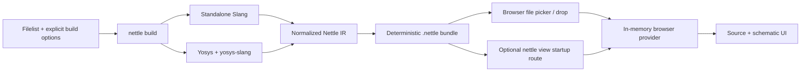

<!-- SPDX-License-Identifier: Apache-2.0 -->

# Nettle Architecture

Status: current bundle-first implementation, reviewed 2026-06-22

## System shape

The versioned `.nettle` format separates compilation from viewing. In the
default hosted viewer, a selected bundle moves from the browser's file API into
browser memory and nowhere else. For local use, `nettle view BUNDLE` serves one
explicit bundle from a fixed `no-store` route. `nettle render` builds, validates,
and serves a durable bundle. Neither command exposes the HDL project or adds a
compilation or upload API.

## Repository ownership

- `src`: the single native `nettle` crate and CLI. Its `builder` and `compiler`
  modules own filelist normalization, compiler discovery and execution,
  compiler-output merge, referenced-source collection, and optional static
  viewer hosting.
- `src/bundle`: canonical Protobuf messages, normalized IR conversion,
  deterministic ZIP writer, reader, validation, hashes, and security limits.
- `src/ir`: compiler-neutral graph, stable semantic IDs, Yosys import, Slang
  semantic/provenance merge, and hierarchy projection primitives.
- `proto/nettle.proto`: canonical versioned bundle schema compiled by the root
  crate's build script.
- `web`: static React application, browser ZIP/Protobuf reader, local provider,
  bounded decoded-object caches, Monaco source pane, ELK layout, SVG renderer,
  and interaction state.
- `integration_tests/bedrock-rtl`, `integration_tests/ibex`, and
  `integration_tests/opentitan`: immutable upstream repository manifests plus
  Nettle-owned filelists and test metadata shared by builder/compiler
  regressions and end-user demos. The integration runner sparse-checks out each
  upstream repository at its full manifest SHA in a temporary workspace; no
  third-party HDL is stored in the Nettle source tree.
- `integration_tests/smoke`: minimal Nettle-authored compiler fixture.

If this overview conflicts with `NETTLE_FILE_FORMAT.md`, the bundle specification
wins.

## Native builder

`nettle build` requires an explicit filelist and output, supplied as CLI options
or through a YAML configuration. The top must be passed or declared by the
filelist. The project root defaults to the filelist parent and is a canonical
containment boundary for every embedded source.

The builder:

1. normalizes nested filelists while preserving argument origins;
2. validates explicit parameters, defines, and undefines;
3. capability-probes standalone Slang and Yosys+yosys-slang;
4. runs the two compiler paths concurrently in a private mode-0700 temporary
   directory;
5. imports connectivity from Yosys JSON and semantic parameters/provenance from
   the matching Slang AST;
6. normalizes stable snapshot and module graph identities;
7. resolves only referenced UTF-8 source files inside the project root; and
8. writes the deterministic bundle atomically to the requested destination.

Net provenance is driver-oriented. For a source-visible signal, the merge uses
the exact Slang assignment right-hand-side range when available, including
assignments nested in procedural blocks. Otherwise it uses the source range of
the Yosys node driving the edge (an operator, register, instance, or constant),
and falls back to the signal declaration only when no driver range survives.

Compiler JSON and transcripts are transient by default. `--debug-artifacts`
copies them under `debug/` and advertises that privacy-relevant feature in the
manifest.

The builder never invokes a command shell with project-controlled text. Tool
arguments are passed as process argument arrays, and generated command files
use format-specific quoting and private temporary storage.

## Bundle boundary

The bundle contains a JSON manifest plus independently addressable Protobuf
indexes and module graphs. Referenced sources are content-addressed. Payload
hashes cover every entry except the manifest, and index records repeat the
identity and object counts needed to reject inconsistent data.

The schema represents Nettle IR, not Slang or Yosys syntax. This isolates the
viewer from compiler version changes and lets future builders target the same
viewer contract.

Compatibility rules:

- reject unknown major versions;
- accept additive fields within the same major according to Protobuf unknown
  field semantics;
- never reuse published field numbers;
- reject unknown required manifest features; and
- keep deterministic entry and repeated-record ordering.

## Browser-local provider

The application starts with no project or example. The user selects or drops a
`.nettle` file. If the host provides `/startup.nettle`, the viewer wraps it in
the same File/Blob provider. The provider first reads the ZIP central directory
and manifest, checks the entry set and resource limits, and then verifies each
payload's SHA-256 before decoding it.

The design index, source index, and diagnostics are eager because they are
small navigation metadata. Module graphs and source bodies are lazy. Separate
byte-bounded LRU caches prevent navigation through a large hierarchy from
retaining the entire expanded design.

The provider presents the same graph/source operations needed by the existing
UI without using HTTP. Transparent-instance and equal-depth projections are
composed from immutable module messages in the browser and remain subject to a
hard visible-object budget.

Monaco and the schematic surface are dynamically imported only after a bundle
opens. ELK layout runs in its worker and is keyed by topology plus the selected
layout profile. Label, clock/reset visibility, and constant-radix changes are
presentation-only operations which do not recompile or re-read the bundle;
signal hiding also avoids relayout.

## Static distribution

`npm run build` produces a self-contained `web/dist`. It may be deployed to any
HTTPS-capable static host, CDN, internal web server, or local `nettle view`
process. HTTPS is required for the Web Crypto APIs on non-loopback origins.

The optional Docker image contains only `web/dist`, the `nettle` binary used as
a static host, and basic runtime libraries. It contains no Slang, Yosys,
examples, source tree, default filelist, default bundle, upload endpoint, or
session storage.

The static host is not an authentication boundary. Cluster deployments should
apply their normal ingress authentication, authorization, TLS, CSP, and asset
cache policy. Picker/drop bundles never leave the browser, so the host needs no
cloud credentials or design-data tenancy controls. A startup bundle is
downloadable by every client that can reach the local host, so keep that mode
on loopback unless another access-control layer protects it.

## Security invariants

- Bundle readers never generically extract ZIP entries.
- Entry names, membership, compression, local/central headers, expanded sizes,
  compression ratios, and hashes are checked before payload use.
- Protobuf collection counts, module/source indexes, and graph object totals are
  bounded and cross-checked.
- Sources are displayed as text in read-only Monaco models; they are not
  executed or injected as HTML.
- The browser does not persist bundles in cookies, IndexedDB, or local storage,
  and the viewer has no upload/persistence API. A startup bundle remains the
  caller-owned file explicitly passed to `view` or written by `render`; the
  static host does not copy it into a session store.
- Replacing a bundle is atomic from the user's perspective: a failed candidate
  does not discard the active provider.

Bundle SHA-256 values provide integrity, not authenticity. Signing and
encryption are explicitly outside format 1.

## Future hosts

Tauri may later combine the `nettle` CLI and static viewer into one desktop
workflow. It should use a narrow IPC bridge and the same `.nettle` bytes/provider
contract; it must not introduce a second graph schema.

A VS Code host can likewise replace source-navigation presentation while using
the same bundle provider. Neither future host is required for the browser-local
version 1 product.
