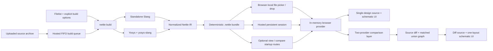
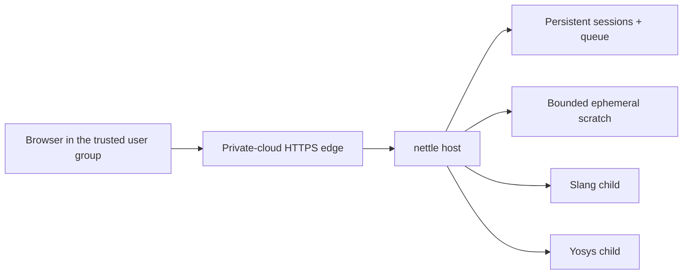

<!-- SPDX-License-Identifier: Apache-2.0 -->

# Nettle Architecture

Status: current bundle-first implementation, reviewed 2026-07-17

## System shape

The versioned `.nettle` format separates compilation from viewing. In the
browser-local workflow, selected bundles move from the browser's file API into
browser memory and nowhere else. The optional `nettle host` service adds
explicit upload, persistence, sharing, and queued source compilation without
changing the bundle or browser-provider contracts.

For local use, `nettle view BUNDLE` serves one explicit bundle from a fixed
`no-store` route. `nettle compare REFERENCE CANDIDATE` serves a non-cacheable
descriptor and two fixed non-cacheable bundle routes after validating both
inputs. `nettle render` builds, validates, and serves a durable bundle. Before
binding, each startup mode copies its selected archive into private, anonymous
delete-on-close storage and validates that exact copy. Route handlers stream
only the snapshot, so replacing or rewriting the caller-owned path cannot
change a running workspace. Anonymous snapshots have no pathname to orphan and
are reclaimed by the operating system after abrupt termination. These local
commands do not expose the HDL project or add an upload API.

## Repository ownership

- `src`: the single native `nettle` crate and CLI. Its `builder` and `compiler`
  modules own filelist normalization, compiler discovery and execution,
  compiler-output merge, referenced-source collection, and optional static
  viewer or persistent hosted-service operation.
- `src/bundle`: canonical Protobuf messages, normalized IR conversion,
  deterministic ZIP writer, reader, validation, hashes, and security limits.
- `src/ir`: compiler-neutral graph, stable semantic IDs, Yosys import, Slang
  semantic/provenance merge, and hierarchy projection primitives.
- `proto/nettle.proto`: canonical versioned bundle schema compiled by the root
  crate's build script.
- `web`: static React application, browser ZIP/Protobuf reader, local provider,
  bounded decoded-object caches, Monaco source pane, ELK layout, SVG renderer,
  and interaction state.
- `integration_tests/bedrock-rtl`, `integration_tests/ibex`, and
  `integration_tests/opentitan`: immutable upstream repository manifests plus
  Nettle-owned filelists and test metadata shared by builder/compiler
  regressions and end-user demos. The integration runner sparse-checks out each
  upstream repository at its full manifest SHA in a temporary workspace; no
  third-party HDL is stored in the Nettle source tree.
- `integration_tests/smoke`: minimal Nettle-authored compiler fixture.

If this overview conflicts with `NETTLE_FILE_FORMAT.md`, the bundle specification
wins.

## Native builder

`nettle build` requires an explicit filelist and output, supplied as CLI options
or through a YAML configuration. The top must be passed or declared by the
filelist. The project root defaults to the filelist parent and is a canonical
containment boundary for every embedded source.

The builder:

1. normalizes nested filelists while preserving argument origins;
2. validates explicit parameters, defines, and undefines;
3. capability-probes standalone Slang and Yosys+yosys-slang;
4. runs the two compiler paths concurrently in a private mode-0700 temporary
   directory;
5. imports connectivity from Yosys JSON and semantic parameters/provenance from
   the matching Slang AST;
6. normalizes stable snapshot and module graph identities;
7. resolves only referenced UTF-8 source files inside the project root; and
8. writes the deterministic bundle atomically to the requested destination.

Net provenance is driver-oriented. For a source-visible signal, the merge uses
the exact Slang assignment right-hand-side range when available, including
assignments nested in procedural blocks. Otherwise it uses the source range of
the Yosys node driving the edge (an operator, register, instance, or constant),
and falls back to the signal declaration only when no driver range survives.

Compiler JSON and transcripts are transient by default. `--debug-artifacts`
copies them under `debug/` and advertises that privacy-relevant feature in the
manifest.

The builder never invokes a command shell with project-controlled text. Tool
arguments are passed as process argument arrays, and generated command files
use format-specific quoting and private temporary storage.

## Bundle boundary

The bundle contains a JSON manifest plus independently addressable Protobuf
indexes and module graphs. Referenced sources are content-addressed. Payload
hashes cover every entry except the manifest, and index records repeat the
identity and object counts needed to reject inconsistent data.

The schema represents Nettle IR, not Slang or Yosys syntax. This isolates the
viewer from compiler version changes and lets future builders target the same
viewer contract.

Compatibility rules:

- reject unknown major versions;
- accept additive fields within the same major according to Protobuf unknown
  field semantics;
- never reuse published field numbers;
- reject unknown required manifest features; and
- keep deterministic entry and repeated-record ordering.

## Browser-local provider

The application starts with no project or example. The user selects or drops a
`.nettle` file, or chooses a reference and candidate in the comparison dialog.
If the host provides `/startup.nettle`, the viewer wraps it in the same File/Blob
provider. A comparison startup descriptor names two fixed bundle routes, and
each response is independently passed through that same provider. The provider
first reads the ZIP central directory and manifest, checks the entry set and
resource limits, and then verifies each payload's SHA-256 before decoding it.

The design index, source index, and diagnostics are eager because they are
small navigation metadata. Module graphs and source bodies are lazy. Separate
byte-bounded LRU caches prevent navigation through a large hierarchy from
retaining the entire expanded design.

The builder correlates Slang's elaborated AST with its concrete syntax tree to
record which conditional, case, and loop-generate bodies contributed to each
elaborated module graph. Those slice-scoped ranges let Monaco de-emphasize
untaken branches and let generate headers fall back to the nearest elaborated
graph origin inside the same active construct. Transparent projections merge
the child slices' activity, so highlighting always describes the visible
schematic rather than every instance that shares a source file.

The provider presents the same graph/source operations needed by the existing
UI without using HTTP. Transparent-instance and equal-depth projections are
composed from immutable module messages in the browser and remain subject to a
hard visible-object budget.

Monaco and the schematic surface are dynamically imported only after a bundle
opens. ELK layout runs in its worker and is keyed by topology plus the selected
layout profile. Label, clock/reset visibility, and constant-radix changes are
presentation-only operations which do not recompile or re-read the bundle;
signal hiding also avoids relayout.

## Comparison workspace

Schematic diff mode composes two normal single-snapshot providers; it does not
change the `.nettle` format or merge snapshots at the archive boundary. Source
inventories are paired by project-relative path and content digest, while graph
correspondence is computed from stable IDs, names, source-line mappings, and
local topology. Conservative matching accepts only unique correspondence;
aggressive matching adds bounded, scored, visibly identified heuristics.
Legacy Yosys operator IDs are accepted as exact anchors only when their glyph
class is also compatible, because older source-position IDs can survive while
naming a different operator after a refactor. Source and aggressive stages may
still recover those changes without treating the legacy ID as proof.

The comparison layer retains both original graphs and produces a transient
union `GraphSlice` with side-qualified identities. Matched objects occupy one
layout object, while reference-only and candidate-only objects remain distinct.
The selected layout engine receives that union once—ELK for ordinary views or
the bounded fast overview for large views—ensuring that every visible
connection is routed in one coherent layout. Diff status and before/after
provenance stay outside the canonical graph schema.

For each paired module slice, comparison proceeds in a fixed order: establish
node correspondence, pair ports inside matched nodes, remap both snapshots onto
the shared node/port identities, pair edges by those remapped endpoints, build
the union, and invoke layout. Matching policy answers _whether two objects
correspond_; diff status then answers _whether the paired payloads differ_.
Consequently, switching from conservative to aggressive can collapse a red
removal and green addition into one heuristically styled matched object;
payload comparison then classifies that object as unchanged or yellow modified.
This is an inferred correspondence, not a functional-equivalence result, and
changing the correspondence can change union topology and require a new layout.

Status classification deliberately excludes snapshot IDs, source ranges,
placement, and volatile compiler provenance:

- an unmatched reference or candidate object is `removed` or `added`;
- node correspondence requires the same broad kind; once paired, a node is
  `modified` when its label, glyph, referenced definition, parameters, or ports
  differ; port payload includes name, direction, role, index, and width;
- different broad node kinds therefore remain removal plus addition, while a
  same-kind operator change such as add-to-subtract may be modified only when
  a unique source-line mapping or aggressive heuristic evidence establishes
  correspondence;
- edges correspond only when their remapped endpoint node/port pairs agree;
  label, width, signal-type, or role changes then make one modified edge, while
  rewiring produces one removed and one added edge; and
- groups compare name, definition, parameters, and mapped child membership;
  the top module compares name, definition, and parameters.

The header's current-slice schematic-change total is unfiltered and includes
nodes, edges, groups, and a changed top module. The schematic footer reports
the corresponding counts after the active View preset and status filters are
applied. Ports roll up into their owning node and are not counted separately.
Connectivity-only changes do not automatically mark their endpoint nodes
modified.

The single View menu combines presets and status visibility controls:

| View               | Semantics on the fixed union geometry                                                                                             |
| ------------------ | --------------------------------------------------------------------------------------------------------------------------------- |
| Reference snapshot | Uses reference payloads, hides candidate-only objects, and removes diff decoration.                                               |
| Diff overlay       | Shows the complete union: removed red/dashed, added green, modified yellow/dashed, and unchanged neutral.                         |
| Candidate snapshot | Uses candidate payloads, hides reference-only objects, and removes diff decoration.                                               |
| Changes only       | Uses diff-overlay semantics while hiding unchanged objects except dim connectivity context needed to understand a visible change. |

Matched union objects use candidate-visible payloads in Diff overlay. All four
views reuse the same union geometry and do not relayout merely to change a
preset. Reference and Candidate are therefore side-specific semantic
projections, not independently laid-out standalone schematics. Diff status is
communicated by red/green/yellow highlighting, line patterns, and accessible
status text. Status
toggles are offered for overlay views and omitted when they have no entities in
the active projection; the UI does not assume that `modified` is globally
impossible under conservative matching.

Hierarchy projection is comparison-aware. For selected or recursive
flattening, the viewer loads and compares each child pair first, then splices
the child union through the paired boundary ports. Union and side-qualified
identities are scoped at every instance depth, so matched and one-sided children
retain their correspondence and source origins without re-matching two
independently flattened snapshots. A one-sided instance compares its existing
child against an empty peer. Logic moved across unrelated hierarchy boundaries
is not matched globally, and a descendant-only change need not modify the
collapsed instance payload; hierarchy navigation reports that the instance
contains changes.

Comparison source bodies and hierarchy modules remain lazy. The two providers
share the existing browser cache envelope, and the union graph must satisfy the
same visible-object ceiling as a single projected graph. Source-diff and fuzzy
candidate limits are generated from `resource-limits.yaml`. Bounded source
diffing and graph matching run in disposable workers; policy, hierarchy, and
workspace changes terminate obsolete work before it can publish a stale
result. The viewer retains side-qualified selection identity across a policy
change and resolves it onto the newly laid-out union.

Opening the comparison hierarchy starts one abortable root traversal shared by
all mounted instance rows. It indexes descendant-change status by stable paired
instance identity, reuses repeated child specializations, and applies the same
reachable-hierarchy pair and time ceilings as source-only evidence. Exhaustion
is presented as an explicit unknown status rather than as an unchanged subtree.

## Static distribution

`npm run build` produces a self-contained `web/dist`. It may be deployed to any
HTTPS-capable static host, CDN, internal web server, or local `nettle view`
process. HTTPS is required for the Web Crypto APIs on non-loopback origins.

The optional Docker image contains only `web/dist`, the `nettle` binary used as
a static host, and basic runtime libraries. It contains no Slang, Yosys,
examples, source tree, default filelist, default bundle, upload endpoint, or
session storage.

The static host is not an authentication boundary. Cluster deployments should
apply their normal ingress authentication, authorization, TLS, CSP, and asset
cache policy. Picker/drop bundles never leave the browser, so the host needs no
cloud credentials or design-data tenancy controls. A startup bundle, and both
sides of a startup comparison, are downloadable by every client that can reach
the local host, so keep those modes on loopback unless another access-control
layer protects them.

## Hosted service

`nettle host` packages the static application, upload API, durable FIFO queue,
session store, and one compiler worker into one long-lived process. The
recommended deployment is one fixed Pod containing one non-root container:

Nettle does not create Pods, containers, or other workloads. It needs no
container-runtime socket, Kubernetes API permission, cloud credential, or
outbound network access. A single-replica `Recreate` deployment prevents two
queue managers from concurrently using the same filesystem store.

### Deployment and threat model

Version 1 is intended for a private cluster used by one group of equally
trusted people. Private-cluster reachability is the user-group boundary.
Nettle does not identify users, keep accounts, or require per-user
authentication. The HTTPS edge may authenticate membership in the group, but
that is a site policy rather than a Nettle protocol requirement. Every client
that can reach the service may upload a bundle, submit a build, and consume
shared queue and storage capacity.

The people in that reachable group are trusted not to attack each other or
deliberately damage shared sessions. Their uploaded bytes are not trusted:
archives, filelists, RTL, `.nettle` bundles, compiler diagnostics, and generated
bundles may be malformed or adversarial. This distinction protects the service
from accidental bad inputs and common parser, path, and resource-exhaustion
attacks without claiming hostile-user tenancy isolation.

The assets are temporarily retained source archives; persistent bundles, which
may embed referenced source and debug artifacts; capability tokens; queue
metadata; and service/storage availability. The relevant boundaries are:

- the browser-to-ingress connection, which must be HTTPS;
- the private-cluster network boundary, which limits who can reach the
  unauthenticated service;
- the untrusted-upload boundary at the HTTP, archive, bundle, and filelist
  parsers; and
- the child-process boundary around Slang and Yosys.

`/scratch` and `/data` have different lifetimes, but they are not security
boundaries from the compiler. The web server and compiler children share one
container and user, so a compromised compiler can read or modify the mounted
session volume and can impair the web server. That is an explicit simplicity
tradeoff for this mutually trusted private-cloud deployment.

The landing page keeps three operations distinct:

1. open a local `.nettle` through the existing in-memory provider, making no
   upload request;
2. explicitly upload and persist a validated `.nettle`; or
3. explicitly upload a source archive, admit it to the durable queue, compile
   it, validate the result, and persist the resulting `.nettle`.

Hosted sessions are addressed by high-entropy capability URLs. A ready session
can be viewed through the normal provider and downloaded as a `.nettle` file.
Anyone able to reach the service and possessing the URL has the same access.
The token is the only per-session authorization; it is a bearer secret, not a
user identity. Nettle provides no session enumeration, revocation, or
identity-based access control in version 1.
The UI discloses that sharing and the configured retention policy before an
upload and again on the session page.

Reference/candidate comparison remains a browser operation. Two local bundles
can be compared without any session API call, and a bundle already fetched
from a hosted session can be used as one side. Nettle does not add a
server-side comparison job, comparison artifact, or comparison-specific
persistence.

Queue metadata and temporary source archives live on the persistent volume so
an admitted job survives process or Pod restart. Exactly one source build runs
at a time. An interrupted active build returns to its original FIFO position
once and is marked failed after another interruption. Source archives are
deleted at terminal success or failure; successful sessions retain only the
validated bundle and minimal metadata.

Each build uses a private directory on a bounded scratch volume, an allowlisted
environment, bounded diagnostics, a process group, and a deadline. Archive and
filelist paths must remain within the extracted request root. Scratch is
removed after every attempt, and a completed bundle is validated before an
atomic session-store commit.

### Enforced controls

The hosted process enforces upload-size, archive-entry, expansion,
compression-ratio, path-depth, bundle, queue, output, and build-time limits. It
rejects archive traversal, links and special files, duplicate paths,
unsupported source extensions, out-of-root filelist arguments, and malformed
ZIP/TAR metadata before invoking a compiler. Uploads and metadata use
same-filesystem staging, file synchronization, and atomic rename. Capability
tokens contain 256 random bits; invalid, expired, and unknown tokens have the
same response. Source archives are removed after terminal success or failure,
and retention applies only to terminal sessions.

Compiler children receive an allowlisted environment, request-private `HOME`
and `TMPDIR`, bounded output capture, one process group, and a hard deadline.
The process group is terminated on timeout or server shutdown. The application
sets private/no-store and browser hardening headers and does not load
third-party analytics.

### Admin deployment requirements

The checked-in [`deploy/kubernetes.yaml`](deploy/kubernetes.yaml) expresses the
single-Pod shape, read-only root filesystem, dropped capabilities, seccomp,
resource limits, dedicated PVC, bounded scratch, and outbound-network denial.
The admin must additionally:

- expose only the ClusterIP Service through a managed HTTPS ingress or gateway
  and redirect plaintext HTTP;
- restrict cluster ingress so other workloads cannot bypass that edge;
- decide whether the edge authenticates membership in the trusted group;
- provide an encrypted `ReadWriteOncePod` volume and appropriate backup policy;
- ensure the CNI enforces the deny-egress policy and provide no cloud
  credentials or service-account token;
- choose CPU, memory, scratch, PVC, queue, deadline, and retention limits for
  the installation;
- configure ingress request-body and upload/read timeouts consistently with
  `--max-upload-bytes`; and
- suppress or redact `/s/<token>` and `/api/v1/sessions/<token>/...` in ingress,
  proxy, and observability logs.

The Service's HTTP port is an internal hop after TLS termination; it must not be
published directly. Capability URLs must not be placed in tickets, chat rooms,
or logs with a broader audience than the trusted group.

### Accepted residual risks and non-goals

- A compiler exploit can access persisted sessions or exhaust the shared
  container resource limit. An OOM can restart the whole Pod; the durable queue
  retries an interrupted build once.
- There is no hostile-user isolation, per-user quota, attribution, session
  revocation, priority, cancellation, horizontal scaling, or high-availability
  queue manager.
- Retention deletion is not secure erasure and does not remove copies from
  storage snapshots or admin-managed backups. Successful bundles continue to
  contain referenced source text after the raw upload is removed.
- Network privacy, TLS keys, storage encryption, cluster-admin access, and
  backup access are outside the application boundary.

These tradeoffs are acceptable only while all reachable users are equally
trusted. A public or mutually untrusted deployment needs additional
identity-based authorization, quotas and abuse controls, capability revocation,
and a stronger compiler/storage isolation boundary; the version 1 manifest
does not claim to provide those properties.

## Security invariants

- Bundle readers never generically extract ZIP entries.
- Entry names, membership, compression, local/central headers, expanded sizes,
  compression ratios, and hashes are checked before payload use.
- Protobuf collection counts, module/source indexes, and graph object totals are
  bounded and cross-checked.
- Sources are displayed as text in read-only Monaco models; they are not
  executed or injected as HTML.
- The browser-local workflow does not persist bundles in cookies, IndexedDB,
  or local storage, make a create-session request, or transmit bundle bytes.
  The landing page may read non-secret hosted policy from `/api/v1/config`;
  hosted persistence starts only after an explicit, disclosed user action.
- For `view`, `render`, and `compare`, the native host makes one anonymous
  delete-on-close archive snapshot per startup side and validates it. Each copy
  is capped by `bundle.archive.totalBytes`; comparison can therefore consume up
  to twice that temporary-storage ceiling. The snapshots have no filesystem
  pathname to orphan, and the operating system reclaims them when their final
  handles close, including after abrupt process termination.
- Replacing a bundle is atomic from the user's perspective: a failed candidate
  does not discard the active provider.

Bundle SHA-256 values provide integrity, not authenticity. Signing and
encryption are explicitly outside format 1.

## Future hosts

Tauri may later combine the `nettle` CLI and static viewer into one desktop
workflow. It should use a narrow IPC bridge and the same `.nettle` bytes/provider
contract; it must not introduce a second graph schema.

A VS Code host can likewise replace source-navigation presentation while using
the same bundle provider. Neither future host is required for the browser-local
version 1 product.
