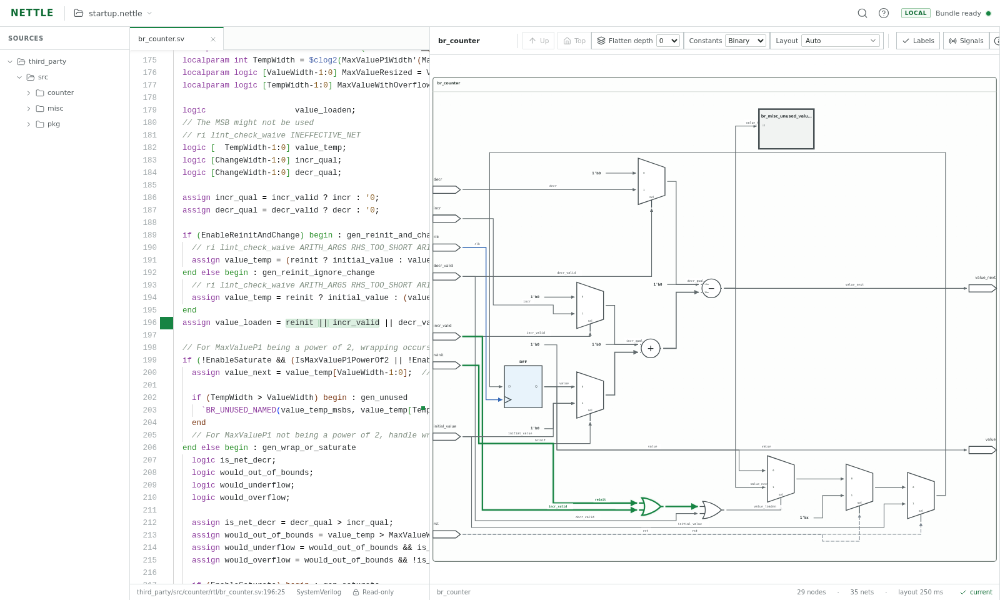

<!-- SPDX-License-Identifier: Apache-2.0 -->


# Nettle

Nettle (**NETlist Traversal and Topology Layout Explorer**) turns elaborated
Verilog and SystemVerilog into a portable `.nettle` bundle and opens it as an
interactive schematic in a web browser. Use it to understand synthesized RTL
connectivity, navigate or selectively flatten hierarchy, cross-probe source and
schematic objects, and share a reviewable snapshot without sharing a compiler
environment.

Nettle deliberately separates its portable bundle from viewing. The native CLI
runs standalone Slang and Yosys with yosys-slang to normalize a design into a
versioned ZIP + Protobuf bundle. Opening a local bundle still validates and
renders it entirely in browser memory without uploading it. An optional
private-cloud service adds explicit bundle sharing and queued server-side
compilation without changing that local workflow.

## Try the public demo

The GitHub Pages deployment at <https://xlsynth.github.io/nettle> hosts the
browser viewer with two public examples: the RTL Bedrock CDC FIFO used by the
browser regression and Nettle's schematic diff fixture. You can also
open a local `.nettle` file; local files are read and rendered entirely in the
browser and are never uploaded. The demo is a static viewer, not a hosted HDL
compiler, and its bundled examples (including their sources) are public.

## Demo

The demo builds `br_counter.nettle` from the manifest-pinned upstream
`br_counter.sv` design and starts the viewer at <http://127.0.0.1:8090>.



Run all commands from the repository root.

First prepare the demo corpus. This clones Bedrock-RTL, sparse-checks out the
full Git SHA in `integration_tests/bedrock-rtl/manifest.json`, and keeps the
upstream sources under the ignored `target/` directory:

```sh
scripts/check-design-corpus.py --prepare-only --corpus bedrock-rtl \
  --workspace target/design-corpora
```

### Build and view with the combined image

The combined Nettle image is the recommended quickstart. It is
Linux/amd64 because the pinned HDL compiler toolchain does not publish a
Linux/arm64 archive. `render` leaves the generated bundle in the mounted
checkout and serves it until you stop the foreground container.

```sh
docker run --rm --platform linux/amd64 \
  -p 127.0.0.1:8090:8080 \
  -v "$PWD:/work" -w /work \
  ghcr.io/xlsynth/nettle:latest render \
  --filelist target/design-corpora/bedrock-rtl/br_counter.f \
  --project-root target/design-corpora/bedrock-rtl \
  --top br_counter \
  --output br_counter.nettle
```

Open <http://127.0.0.1:8090> while the container runs.
Do not open `http://0.0.0.0:8080`: it is the container's bind address, not a
browser URL. Browsers treat it as an insecure origin and disable the Web Crypto
API Nettle uses to validate bundles.

On Docker Engine for Linux, add `--user "$(id -u):$(id -g)"` to keep the output
bundle owned by the calling user. The same command works with `podman` in place
of `docker`; add `--userns=keep-id:uid=10001,gid=10001` and mount the checkout
with `:Z` when SELinux relabeling is required.

### Build the combined image locally

Build the `nettle` target, then use `nettle:latest` in place of
`ghcr.io/xlsynth/nettle:latest` in the command above. First record the build
metadata from the checkout:

```sh
NETTLE_BUILD_DATE_UTC="$(date -u +%Y-%m-%dT%H:%M:%SZ)"
NETTLE_BUILD_GIT_SHA="$(git rev-parse HEAD)"
if [ -n "$(git status --porcelain --untracked-files=normal)" ]; then
  NETTLE_BUILD_STATE=dirty
elif ! git for-each-ref --contains HEAD --format='%(refname)' \
  refs/heads/main refs/remotes |
  grep -Eq '(^refs/heads/main$|^refs/remotes/.+/main$)'; then
  NETTLE_BUILD_STATE=dev
else
  NETTLE_BUILD_STATE=clean
fi
export NETTLE_BUILD_DATE_UTC NETTLE_BUILD_GIT_SHA NETTLE_BUILD_STATE
```

Pass those values into the image build:

```sh
docker build --platform linux/amd64 \
  --build-arg NETTLE_BUILD_DATE_UTC \
  --build-arg NETTLE_BUILD_GIT_SHA \
  --build-arg NETTLE_BUILD_STATE \
  -f Dockerfile --target nettle -t nettle:latest .
```

### Container image

Nettle publishes one Linux/amd64 image, `ghcr.io/xlsynth/nettle`, with the
compiler toolchain, static viewer, and hosted service. Use `build`, `view`,
`render`, or `host` according to the workflow you need.

### Run without containers

This path builds and runs Nettle directly on the host. First install the
[native system dependencies](#native-system-requirements), then verify the HDL
compiler toolchain and build Nettle and its static viewer:

```sh
scripts/check-toolchain.sh
cargo build --locked
npm ci
npm run build
```

Build and view the demo bundle:

```sh
cargo run --locked -- render \
  --filelist target/design-corpora/bedrock-rtl/br_counter.f \
  --project-root target/design-corpora/bedrock-rtl \
  --top br_counter \
  --output br_counter.nettle \
  --web-root web/dist \
  --port 8090
```

Open <http://127.0.0.1:8090>; Nettle opens `br_counter.nettle` directly.
Press Ctrl-C in the terminal to stop the viewer.

## Development

### With containers

See [Build the combined image locally](#build-the-combined-image-locally) for
the interactive image build command. To run the complete test suite in its
known-good toolchain container, record and export the same build metadata, then
build the root Dockerfile's `test` target:

```sh
docker build --platform linux/amd64 \
  --build-arg NETTLE_BUILD_DATE_UTC \
  --build-arg NETTLE_BUILD_GIT_SHA \
  --build-arg NETTLE_BUILD_STATE \
  -f Dockerfile --target test -t nettle-test .
```

### Native system requirements

Native development works on any host where the required compiler tools are
available. On Linux/amd64, the versions below match the known-good container.
On macOS/arm64 or Linux/arm64, install or build native host versions of Slang
and Yosys with yosys-slang; the pinned standalone Slang Linux release is
amd64-only. Install:

- Rust 1.88 or newer. This checkout selects and validates Rust 1.95.0 through
  `rust-toolchain.toml`.
- standalone Slang 11 or newer. Slang 11.0 is the known-good release. Nettle checks
  for the command-file, top selection, JSON diagnostics/AST, define, undefine,
  and parameter capabilities it uses.
- Yosys with a compatible yosys-slang plugin. Nettle does not claim a numeric
  Yosys/plugin version range because the two components must be a compatible
  pair; it probes `read_slang` and every required plugin capability before
  compiling. The OSS CAD Suite snapshot dated 2026-06-15 is known good.
- Node.js 20.19 or later in the 20.x line, 22.12 or later in the 22.x line, or
  24 or newer, plus npm to build the web viewer. Node.js 24 with npm 11 is the
  known-good configuration.
- A modern web browser to use the viewer. Chromium is additionally required to
  run the browser end-to-end tests.

The [`Dockerfile`](Dockerfile) is the source of truth for known-good
toolchains and build environments. Its `builder`, `test`, and `nettle` targets
record the exact Slang release/source commit and checksums, the checksummed OSS
CAD Suite artifact, and the Rust and Node image versions.
Nettle never downloads HDL compilers at runtime. Run
`scripts/check-toolchain.sh` after installing native compiler tools to exercise
their capabilities end to end.

Install the locked JavaScript dependencies and build the static viewer:

```sh
npm ci
npm run build
```

Cargo uses the committed `Cargo.lock`; use `--locked` for reproducible native
builds. A typical local development cycle is:

```sh
scripts/check-toolchain.sh
cargo build --locked
cargo test --locked
npm test
npm run dev
```

The development viewer is then available at <http://127.0.0.1:5173>. Use
`cargo build --locked --release` for an optimized native binary.

## Usage

Run commands from the repository root unless noted otherwise.

### Build and view a bundle

Build the included counter:

```sh
cargo run --locked -- build \
  --filelist target/design-corpora/bedrock-rtl/br_counter.f \
  --project-root target/design-corpora/bedrock-rtl \
  --top br_counter \
  --output br_counter.nettle
```

The project root defaults to the filelist's parent. Set a wider root when a
filelist reaches sources through `..`; every embedded source must canonicalize
inside that boundary. Nettle embeds only referenced UTF-8 sources up to 4 MiB
and records project-relative paths.

Start the built static viewer and select the bundle in its file picker:

```sh
cargo run --locked -- view --web-root web/dist --port 8090
```

Then open <http://127.0.0.1:8090>. The browser reads the selected file; the
static host never receives it. For frontend development, `npm run dev` serves
the application at <http://127.0.0.1:5173>.

Pass a bundle to open it directly:

```sh
cargo run --locked -- view br_counter.nettle --web-root web/dist --port 8090
```

This copies the bundle into a private, size-bounded anonymous temporary
snapshot, validates that exact copy, and exposes it at a fixed, non-cacheable
route. Anonymous storage has no pathname to orphan and is reclaimed by the
operating system when its final handle closes, including after abrupt process
termination. Keep the default loopback bind for sensitive designs. A
non-loopback bind makes the bundle downloadable by reachable clients and
therefore requires the deployment's normal authentication and TLS protections.

`render` combines build and view while leaving the bundle on disk:

```sh
cargo run --locked -- render \
  --filelist target/design-corpora/bedrock-rtl/br_counter.f \
  --project-root target/design-corpora/bedrock-rtl \
  --top br_counter \
  --output br_counter.nettle \
  --web-root web/dist \
  --port 8090
```

### Run the hosted web and compiler service

`nettle host` serves three explicitly separate workflows from one process:

1. open a local `.nettle` entirely inside the browser without uploading it;
2. upload and persist a prebuilt `.nettle`, then view or download it through a
   shareable capability URL; or
3. upload a source archive, wait in the FIFO build queue, and persist, view, or
   download the resulting `.nettle`.

Source uploads default to `project.f` at the archive root. The upload dialog can
instead select any root filelist by its relative archive path, such as
`br_counter/filelist.f`; nested filelists and every declared project path are
validated beneath the extracted archive root before compilation.

Set `NETTLE_AZURE_ENABLE=1` on the hosted process to show an Azure path field
on the landing page. Paste an `az://` path to a `.nettle`, `.zip`, `.tar`,
`.tar.gz`, or `.tgz` blob and press Enter. Nettle runs the separately installed `bbb`
executable to copy that one blob into its bounded scratch filesystem, then
validates and admits it exactly like the corresponding hosted upload. Source
archives can use the same optional relative root filelist. The combined
container already includes the hash-locked `boostedblob` package providing
`bbb`; the native binary contains no Azure SDK and does not manage Azure
credentials.

You must authenticate `bbb` yourself before importing. Start the container with
`-e NETTLE_AZURE_ENABLE=1`, open a shell using
`docker exec -it <container-name> sh`, and sign in using your usual Azure
authentication method. If your deployment makes the container filesystem
read-only and `bbb` needs to save login information, mount a writable directory
for those credentials. Nettle does not sign in to Azure or manage credentials.

The hosted service runs Slang and Yosys as child processes in the same
container. It does not launch nested containers or create Kubernetes workloads.
The v1 deployment is exactly one Pod and one container.

For local evaluation, give the combined image a persistent session volume and
a bounded scratch filesystem:

```sh
docker run --rm --platform linux/amd64 \
  --read-only --cap-drop ALL --security-opt no-new-privileges \
  -p 127.0.0.1:8080:8080 \
  -v nettle-sessions:/data \
  --tmpfs /scratch:rw,nosuid,nodev,noexec,size=4g \
  ghcr.io/xlsynth/nettle@sha256:REPLACE_WITH_PUBLISHED_DIGEST host \
  --storage-root=/data \
  --scratch-root=/scratch \
  --max-queued-builds=32 \
  --build-timeout=600s \
  --evict-after=30d
```

Loopback HTTP is suitable only for local evaluation. A shared deployment must
terminate HTTPS and restrict reachability to its intended private-cloud user
group. Nettle does not authenticate individual users; group authentication at
the ingress is optional and site-dependent.
Capability URLs are bearer secrets: anyone who can reach the service and has a
session URL can view and download its bundle. The UI repeats this fact and the
configured retention period before either upload.

The checked-in [`deploy/kubernetes.yaml`](deploy/kubernetes.yaml) is the
recommended private-cloud starting point. It runs a single non-root replica
with `Recreate`, a PVC backed by the site's encrypted StorageClass, bounded
ephemeral scratch, a read-only root filesystem, dropped capabilities, no
service-account token, and no outbound network. It intentionally leaves
cluster-specific TLS, network access, optional group authentication, hostname,
StorageClass, and image digest configuration to the admin. See
[`deploy/README.md`](deploy/README.md) for setup and operational details.

### Compare two elaborated designs

Build the reference and candidate as independent snapshots, then open schematic
diff mode:

```sh
cargo run --locked -- compare reference.nettle candidate.nettle \
  --matching conservative \
  --web-root web/dist \
  --port 8090
```

The command copies and validates both inputs in anonymous delete-on-close
storage before starting the viewer and exposes the private snapshots only
through separate non-cacheable startup routes. The two snapshots can consume
up to twice the configured per-bundle temporary-storage ceiling; the operating
system reclaims them when their final handles close, including after abrupt
termination. The default conservative policy accepts exact and uniquely
determined graph correspondence. Pass
`--matching aggressive`, or switch policy in the viewer, to distinguish
heuristic matches for logic whose compiler-generated identities changed.

The viewer constructs one union graph and lays it out once: reference-only
objects are red and dashed, candidate-only objects are green, matched changes
are yellow, and unchanged logic remains neutral. Line, outline, and subtle
shadow treatments distinguish diff status and heuristic correspondence. The
single View menu
selects a neutral reference or candidate snapshot, the complete diff overlay,
changes-only presentation, or custom status visibility; every view reuses the
union geometry. Matching is a structural review aid, not a functional-
equivalence result.

Hierarchy navigation and flattening use the same selected policy. Recursive
flattening compares child modules before splicing their union through paired
boundaries, including one-sided instances, and a policy change recomputes the
visible projection. Decoded children are reused while they remain in the
bounded provider caches; evicted modules may be decoded again.

The left pane compares the UTF-8 compilation sources embedded in the two
bundles. This is intentionally a **bundled source diff**, not a complete Git
tree diff: files not included in either snapshot and version-control rename
metadata are unavailable. Different defines, parameters, tops, or compiler
versions are reported separately because they can change the elaborated graph
without changing source text. Diff hunks are labeled `source-only` only after
neither direct source origins nor indirect evidence anywhere in the reachable
paired hierarchy connects them to a schematic change; selecting a
graph-affecting hunk highlights every directly intersecting object in the
visible overlay.

### Parameters, defines, and configuration files

Builder overrides are repeatable, raw single-line SystemVerilog expressions:

```sh
cargo run --locked -- build \
  --filelist project.f \
  --project-root "$PWD" \
  --top top \
  --param WIDTH=16 \
  --define SYNTHESIS \
  --define NUM_HARTS=4 \
  --undefine SIMULATION \
  --output design.nettle
```

Duplicate names, empty values, invalid identifiers, and define/undefine
conflicts are rejected before compilation. Add `--debug-artifacts` only when
raw Yosys JSON, Slang AST JSON, and compiler transcripts are needed; those
artifacts can reveal substantially more project detail.

Larger builds can use YAML:

```yaml
# build.yaml
filelist: filelists/project.f
project_root: .
top: top
output: design.nettle
parameters:
  DEPTH: "32"
  WIDTH: "16"
defines:
  NUM_HARTS: "4"
  SYNTHESIS: null
undefines:
  - SIMULATION
debug_artifacts: false
```

```sh
cargo run --locked -- build --config build.yaml
```

YAML paths are relative to the configuration file; command-line paths are
relative to the current directory. YAML may also set `slang_bin` and
`yosys_bin`. Scalar CLI values override YAML values, while parameter, define,
and undefine collections are combined. Quote expressions and macro values so
YAML preserves them as strings. Unknown fields are rejected. See
[`INPUT_CONFIG_FILE_FORMAT.md`](INPUT_CONFIG_FILE_FORMAT.md) for the complete schema and
merge behavior.

### Inspect and validate bundles

```sh
cargo run --locked -- inspect design.nettle
cargo run --locked -- validate design.nettle
```

`inspect` prints safe summary metadata. `validate` checks archive membership,
resource limits, hashes, Protobuf payloads, source indexes, and module
index/body consistency without extracting files. See
[`NETTLE_FILE_FORMAT.md`](NETTLE_FILE_FORMAT.md) for the normative schema and
compatibility rules.

### Viewer containers and deployment

The unified image can serve the static viewer for existing bundles on
linux/amd64:

```sh
docker run --rm --platform linux/amd64 -p 127.0.0.1:8090:8080 \
  ghcr.io/xlsynth/nettle:latest
```

On Apple silicon hosts, `--platform linux/amd64` selects the published image
architecture.

In a shared deployment, place the static site behind the normal authentication
and HTTPS boundary. Design bytes selected with the file picker remain in each
user's browser. Use the combined image and
[`deploy/kubernetes.yaml`](deploy/kubernetes.yaml) only when upload,
persistence, or server-side compilation is wanted.

### Validation

```sh
scripts/check-rust-docs.py
cargo fmt --all --check
RUSTDOCFLAGS="-D warnings" cargo doc --no-deps --locked
cargo test --locked
cargo clippy --all-targets --all-features --locked
npm run lint
npm test
npm run build
npm run check:deployment
npm run test:e2e
scripts/check-toolchain.sh
npm run test:designs
```

The real-toolchain design regressions are opt-in because they require the
external HDL compilers. The Development section shows how to run the complete
suite in the known-good container environment.

## Project documentation

- [`ARCHITECTURE.md`](ARCHITECTURE.md) describes the software architecture,
  trust boundaries, data flow, and tool design.
- [`NETTLE_FILE_FORMAT.md`](NETTLE_FILE_FORMAT.md) defines the `.nettle` interchange
  format and its security rules.
- [`INPUT_CONFIG_FILE_FORMAT.md`](INPUT_CONFIG_FILE_FORMAT.md) defines the YAML build
  configuration schema and command-line merge behavior.
- [`RESOURCE_LIMITS_FILE_FORMAT.md`](RESOURCE_LIMITS_FILE_FORMAT.md) documents
  the build-time resource-limit policy shared by the native and browser code.
- [`deploy/README.md`](deploy/README.md) documents the single-Pod hosted-service
  deployment and its private-cloud responsibilities.

## License

Nettle is licensed under the [Apache License 2.0](LICENSE).

Integration tests indirectly use third-party repositories that are referenced by manifests.
Third-party sources are not committed into this repository. Nevertheless, manifests identify
third-party provenance and applicable license and notice files.
